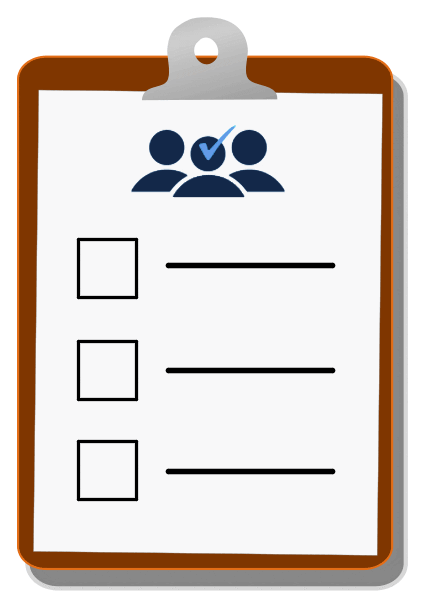
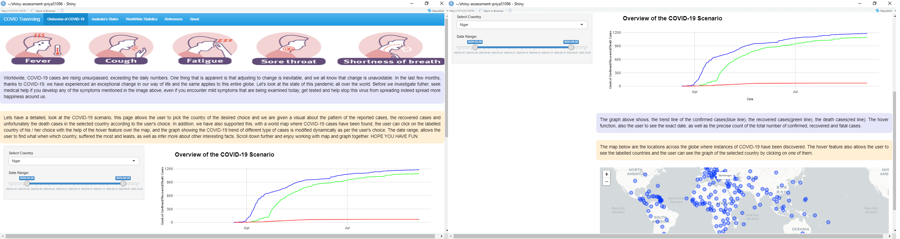
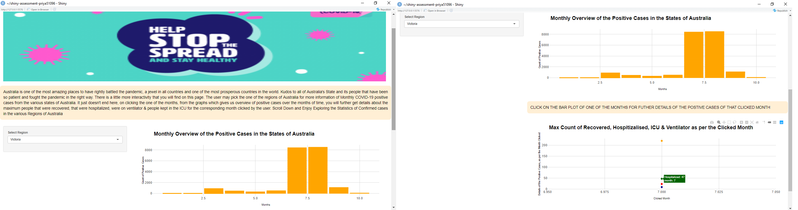
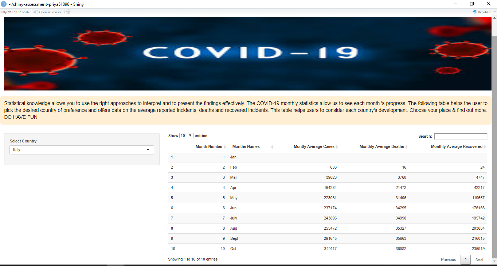

```{r setup, include=FALSE}
knitr::opts_chunk$set(echo = FALSE, message = FALSE, warning = FALSE)
```

```{r, fig.align='center', out.width="100%"}

```


## Credits

I sincerely thank Professor Dr. Emi Tanaka and Tutor Mitchell O'Hara-Wild for introducing us to this wonderful resource it is because of your collaborative efforts and great teaching, I am in the position to write this blog and create my first ever shiny app. Thank you for getting us confident and hope we continue produce more exciting application

## My First Ever Shiny App

A little history of me and R. I've had a very cordial and user-friendly relationship with R for around 9 months now. I was in a total mess initially when I was first introduced to it. I still remember my first class at Monash University, where Professor Stuart Lee taught us about clean data formats and I didn't even know how to create a folder in R during the hands-on session. Looking back at those days, from there to now, it gives me a tiny, (literally very tiny) sense of pride in my journey from not knowing R at all to now building my first ever shiny app.

```{r, fig.align='center', out.width="100%"}

```

[My shiny application]() gives a overview of the newest change we all have adapted to in the recent few months, yes your right it is COVID-19. This pandemic has taught us life lessons and for me personally, has made me a better person as I have gained quite a few skills, this app  being one of them. The applications has a few tabs and on playing around the app, you will find that one of the graph show you the waves of the confirmed, recovered and death in each country. We have further also gone in detail and studied about the positive cases in Australia and statistics of the cases each month in every country where coronavirus cases have been detected.

## Self Evaluation 

Let us take a look at each tab of my shiny application and learn more about what went well, what points can be strengthened, some potential items that can be added, and also self-evaluate my application, which will assist all neophytes like me when developing the first app there, and I can enhance the standard of my job as well as in the future application I have created. Get Ready !! Teacher mode On !! Hope you have fun !!

```{r, fig.align='center', out.width="100%"}

```

### Overview of COVID19 Scenario Across the Globe

The figure \@ref(fig:tab1) reflects my favorite section, my application's landing page. In this application, you can see a date slider that allows the user to see the cases of recovery, confirmation and death of the different country where cases of COVID-19 have been found. The drop down below also helps you to see the various countries where you want to see an overview of how the selected country has been affected by COVID-19.

```{r tab1, fig.align='center', out.height="360px", out.width="900px", fig.cap="Overview of COVID-19 across the Globe"}

```

The best part of the page that went well for me and I think was pretty challenging for me to figure out was, when you click on the map, produced through leaflet you get labels of the countries, on clicking on these labels of the desired country the graph of the overview of COVID-19  changes dynamically, for the selected country and achieving this makes me feel really happy. There are few points that can be improved on this page, I think the layout of the application can be a bit more appealing than the present one as the user has to scroll down to view the rest of the functionality of the applications. I have tried my level best to reduce text and make it an user friendly application. One feature that I wanted to add but did not succeed in doing so was I wanted the size of the circle markers could have been directly proportional to the most affect country by COVID-19. On the whole this my favorite page of the application and I had great fun while making it.

### Australia and it's States

Figure \@ref(fig:tab2) is the next tab in my application. I was also interested in learning more about Australia 's positive cases as it is the present country of my residence and one of the successful countries with effective management of the COVID-19 cases here. This country's data is very well structured and simple to use. The user can pick the desired state of Australia in this section of my application, where the user gets a bar chart of the COVID-19 positive cases in that state over the different months. In addition, if you click on one of the bar chart of any month the user has picked, you will be led to another chart that informs you all about the maximum number of recovered, hospitalized, COVID-19 patients that were on the ventilator on that clicked month and the maximum number of cases that were also in the ICU.

```{r tab2, fig.align='center', out.height="360px", out.width="900px", fig.cap="Australia & States"}

```

This page was a real challenge, because I have never used plotly::event data, it took me such a long time to incorporate this, but I eventually succeeded in doing the same. The development of the COVID-19 bar charts went pretty well, it was very easy to fetch the data for the highest count of the various cases from the dataset. The graphics of the graph over the clicked month are stuff I find that can be strengthened. For this, a statistical overview of the COVID-19 situation of the month you clicked would have been a better approach. Furthermore, I think I should have obtained the latitude and longitude and made a choropleth map rely on the positive cases. I also believe that the layout of this page can be better. Also the image looks a bit over stretched. One feature that I feel could have been added was instead of one drop down, we could have two drop down one for the country and the second one for the states/regions/counties of that country and this should have the graphs for positive cases and the monthly statistics for the selected month. I think I did not know during that time. I could have had set the limit on my sidebar panel. On the whole getting the event_data to work was really fun and an accomplishment in its own way !

### WorldWide Statistics

Statistical information allows the user to make inferences and study around the mean values of the data. Figure \@ref(fig:tab3) is the statistical section of the app. Here the user can select the country of his choice and find the average of the total cumulative cases each month. I feel this page is the one that requires the most improvement. I feel instead we can make a table of the top ten worst hit countries with COVID-19 and show the average cases with colorful horizontal bar charts. 

```{r tab3, fig.align='center', out.height="360px", out.width="900px", fig.cap="Montly Statistics of different Countries"}

```

Instead of cumulative cases each month I could have had used the lag function to display the individual count for each month and give it's statistics. The concept of the DT table being new and making it work to shiny was until initally you understand what goes where. I think I could have also shown the percentage of population affect by COVID-19 if the population data was made available.


## Final Score - (Passed/Fail)

```{r, fig.align='center', out.width="100%"}
knitr::include_graphics("Data/gif4.gif")
```

We have successfully looked into the entire app and see the areas of improvement in each section, Now it is time for the short overview of the things that went well, first a running app without errors is a tiny success. Getting the graphs to change on the different user choice are some of the fancy feature, which increases the user interactivity and thus makes the app more user friendly. Getting plotly::event_data was a challenge and I have successfully implemented it (small pride for it). A table that, that allows the user to select the country and the average cases per month are explained, working DT with shiny app is pretty appericated. The images added to each tab are better accurate and thus makes it more appealing

```{r, fig.align='center', out.width="100%"}

```

We spoke about the alignment of the different in each graph, which means a little more research on how to place to the text correct and how to utilized the space in each tab is what requires a little bit more study. We also self-realized that on over engaging in the app that the visual of of the the graph would have been better. Certain features that should have been added in the app throughout the detailed discussion. A little discussion on how the existing the technology could be improve, reminds me of the endless errors RStudio gives us when we try to deploy the app. The version 4.0.0 of R seems to be obsolete to deploy an application. In addition I feel, they the leaflet package gives us multiple map when we totally zoom out and instead we could have just one layer of the same.

## References


